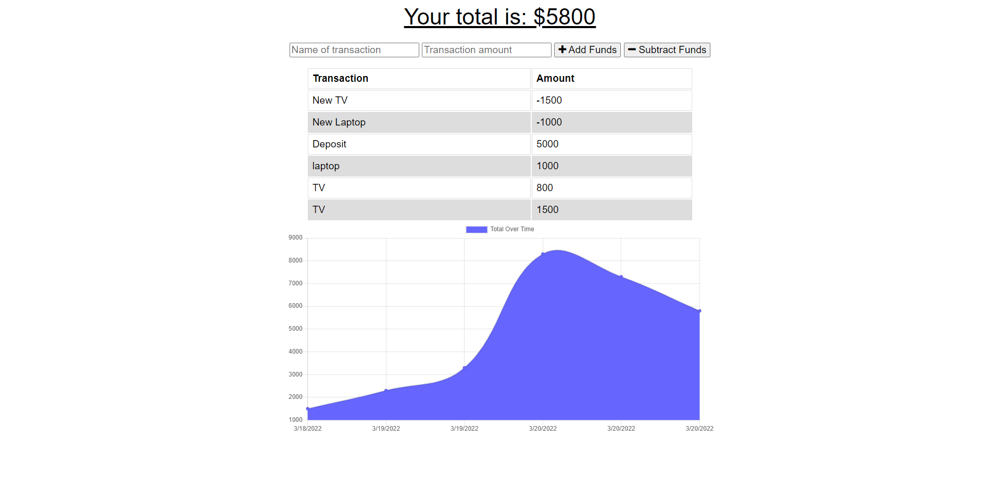

# budget-tracker

## Description
The user will be able to add expenses and deposits to their budget with or without a connection. If the user enters transactions offline, the total should be updated when they're brought back online.

### Application Screenshot


## Table of Content
- [Description](#description)
- [User Story](#user-story)
- [Acceptance Criteria](#acceptance-criteria)
- [Questions](#questions)

## User Story
```
AS AN avid traveler
I WANT to be able to track my withdrawals and deposits with or without a data/internet connection
SO THAT my account balance is accurate when I am traveling 
```

## Acceptance Criteria
```
GIVEN a budget tracker without an internet connection
WHEN the user inputs an expense or deposit
THEN they will receive a notification that they have added an expense or deposit
WHEN the user reestablishes an internet connection
THEN the deposits or expenses added while they were offline are added to their transaction history and their totals are updated
```
### Questions

If you have any questions or inquiries, please reach out through GitHub.

- GitHub: nlimbu07